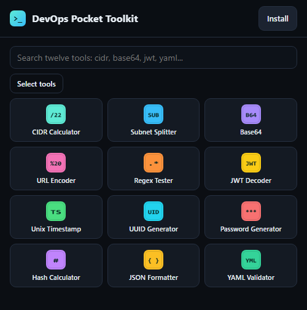
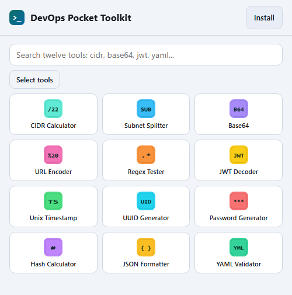

# DevOps Pocket Toolkit

**[sergeyitaly.github.io/devops-toolkit](https://sergeyitaly.github.io/devops-toolkit/)**

Twelve DevOps utilities in one HTML page. No backend, no accounts, no build
step to use it, no network once it has loaded. Add it to a phone home screen
and it behaves like an app - including on a plane, in a basement datacentre, or
on a locked-down laptop.

The page is 162 KB. With the service worker, the manifest and every icon - one
for the toolkit and one for each tool - the whole app is 270 KB.

| | |
|---|---|
|  |  |

The whole toolkit on opening: twelve tools, one screenful, in whichever theme
the device is set to.

## The tools

| Tool | What it does |
|---|---|
| CIDR Calculator | Network, broadcast, host range, netmask, wildcard, scope (RFC 1918, CGNAT, documentation ranges), reverse-DNS name, binary and integer forms. IPv4 and IPv6. |
| Subnet Splitter | Carves a block into equal subnets, or works out the prefix that holds N hosts. IPv4 and IPv6 (128-bit maths, exact counts). |
| Base64 | Encode and decode, URL-safe alphabet, optional padding, 76-column wrapping, hex dump of non-text bytes. |
| URL Encoder | `encodeURIComponent`, `encodeURI` and form encoding, decoding both ways, plus a breakdown of scheme, host, port, path, query parameters and fragment. |
| Regex Tester | Live matches with capture groups and named groups, highlighted subject, optional replacement preview. |
| JWT Decoder | Header, payload, claims with their meanings, issue and expiry times with a relative reading, and warnings for `alg: none` and missing expiry. |
| Unix Timestamp | Seconds, milliseconds, microseconds and nanoseconds detected by magnitude, ISO 8601, UTC, local time, day of year, relative time, and a live clock. |
| UUID Generator | v4 (random) and v7 (time-ordered) in bulk, plus an inspector that reports version, variant and the embedded timestamp. |
| Password Generator | Character-set selection, ambiguous-character exclusion, an entropy figure in bits and a plain-language verdict. |
| Hash Calculator | MD5, SHA-1 and SHA-256 of any text, with a compare box that tells you which of the three a pasted checksum matches. |
| JSON Formatter | Pretty-print, minify, sort keys, structure statistics, and syntax errors reported with a line, a column and the offending line. |
| YAML Validator | Errors by line, warnings for the traps that bite in production (`no` parsed as a boolean, `3.10` losing its zero, `0755` read as octal, duplicate keys, tab indentation), and the JSON the document actually means. |

A search box narrows the grid, and the one-line descriptions appear on wider
screens where there is room for them.

Everything runs in the tab. Nothing you paste - tokens, secrets, manifests -
leaves the device.

## Light and dark

The page follows whatever the phone or laptop is set to - no switch, no stored
preference, nothing to get out of step with the rest of the device. Every
colour is a token defined twice, once on `:root` and once under
`@media (prefers-color-scheme: light)`, and a test checks that both palettes
define the same names and that no rule hardcodes a colour outside them.

Every text-on-background pair in both themes clears the WCAG AA ratio of 4.5:1,
the lowest being 5.0:1.

Two places a static page cannot follow the setting:

- The **splash screen** of an installed app comes from `theme_color` and
  `background_color` in the manifest, which hold one value each. They are the
  dark ones, so a light-mode install flashes dark for a moment on launch.
- The **iOS status bar** in a home-screen app is set by
  `apple-mobile-web-app-status-bar-style`, which also has no light or dark
  variant and is read at launch. It stays black.

## In every tool

- **Examples.** A row of one-tap sample inputs, because the fastest way to show
  what a field wants is to fill it in. The YAML validator's "The traps" example
  is worth a look even if you know YAML well.
- **Help.** A collapsed "What this does, and how to read it" panel explaining
  the output and the decisions behind it - why a /31 has no broadcast address,
  why "no" is a boolean to some parsers, how entropy is counted.
- **Paste.** A button that reads the clipboard straight into the input, for
  pasting a token, a manifest or a checksum from somewhere else. Where a
  browser refuses clipboard reads (Firefox does), it focuses the field and
  tells you to use Ctrl+V instead.
- **Copy.** Tap any output value to copy it.

## Installing it

Open <https://sergeyitaly.github.io/devops-toolkit/> once with a connection -
that first load is what fills the offline cache, including every tool icon.

**Long-press any tool** on the home screen to start picking - the same gesture
a phone uses for choosing icons. Tiles get a selection dot, tapping adds or
removes one, and a bar at the bottom says how many are chosen. "Add to home
screen" then walks you through them one at a time, each with its own icon and
name. On a desktop, right-click a tile or use the "Select tools" button; Escape
or "Done" leaves picking mode.

The **Install** button in the header adds the whole toolkit as a single icon -
or, while a tool is open, just that tool.

- **Android (Chrome, Edge, Firefox):** "Install the whole toolkit" uses the
  browser's own prompt. For a single tool, open it and use the browser menu's
  "Add to Home screen". Once the toolkit is installed, long-pressing its icon
  also opens a shortcut menu containing all twelve tools.
- **iPhone and iPad:** open the page **in Safari** - no other browser on iOS can
  add a web app to the home screen. Open the tool you want, tap Share, then
  "Add to Home Screen": the icon and the name are already set to that tool.
- **Desktop Chrome or Edge:** the install icon in the address bar.

### About folders

A web page cannot create a folder on a phone home screen - only the operating
system can, and only when you drag one icon onto another. What this app can do
is give each tool its own icon and name, so the folder you make yourself looks
like a real set of apps. The install sheet says exactly that rather than
pretending otherwise.

### After an update

The service worker serves from the cache first, so a new version lands on the
*second* launch. Open the app, close it, open it again.

## What it stores

One `localStorage` entry, `devops-pocket-toolkit.v1`, holding the id of the
tool you had open last so it reopens there. That is the whole of it: no
history, no inputs, no analytics, no cookies. The value is checked against the
list of known tools when it is read back. The tools you tick in the install
picker are kept in memory for that sitting only.

## Security

No backend, no accounts, no analytics, no cookies, no third-party code. The
inline script and style are pinned by SHA-256 in a Content-Security-Policy with
no `unsafe-inline` and no `unsafe-eval`, and every push runs the tests plus
CodeQL `security-extended` analysis. The only thing stored on the device is the
one preference described above.

Details, and the things a static host genuinely cannot do, are in
[SECURITY.md](SECURITY.md).

Two honest limits worth stating here as well:

- The **JWT decoder does not verify signatures**. It shows what a token says.
  Whether the signature is genuine is a question for the service that issued it.
- The **YAML validator covers a subset**: block mappings and sequences, flow
  collections, quoted and block scalars, comments, multiple documents. Anchors,
  aliases and explicit tags are reported as unsupported rather than guessed at.

## Working on it

```sh
npm test      # 528 assertions: engine, UI, security, plus the build, CSP and icon checks
npm run build # reassemble index.html from src/ and re-pin the CSP hashes
npm run icons # re-render the app icons, the twelve tool icons and the shortcuts
```

`index.html` is generated: edit the parts in [`src/`](src/) and rebuild. Editing
the assembled file by hand makes the parts stale, and CI fails on it
(`node tools/build.mjs --check`).

```
src/head.html      head tags, the CSP meta tag
src/style.css      the single inline stylesheet
src/body.html      the markup
src/app/*.js       the script, in twelve parts, concatenated in order
tools/build.mjs    assembles index.html
tools/csp.mjs      re-pins the SHA-256 hashes after every edit
tools/tool-icons.mjs  renders one icon per tool, writes the manifest shortcuts
test/              plain Node tests, no dependencies
```

The tests run the shipped page's own script inside a Node `vm` against a stub
DOM, so they test the file that is served rather than a parallel copy.

There are no dependencies, and there is nothing to install.

## Licence

[MIT](LICENSE).
